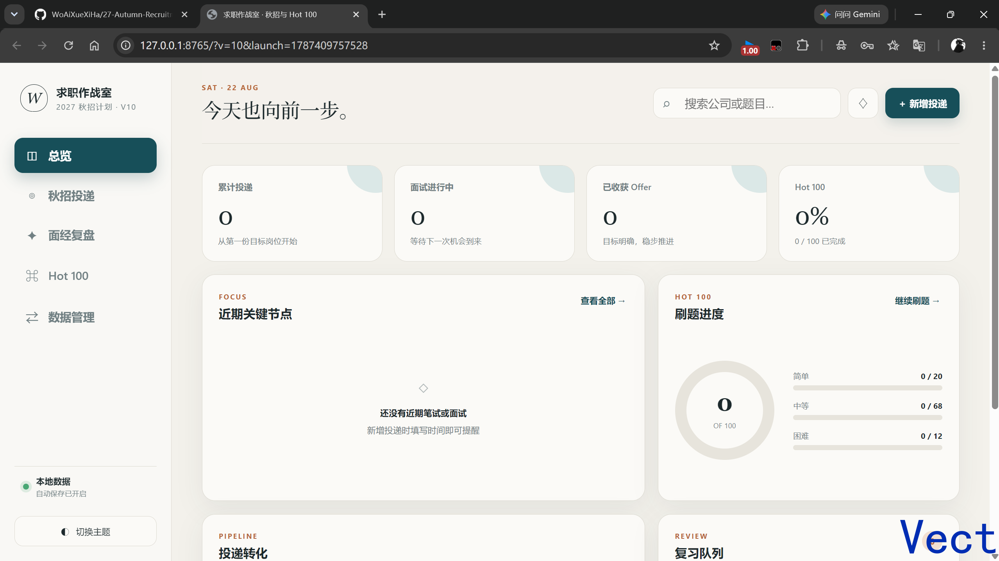
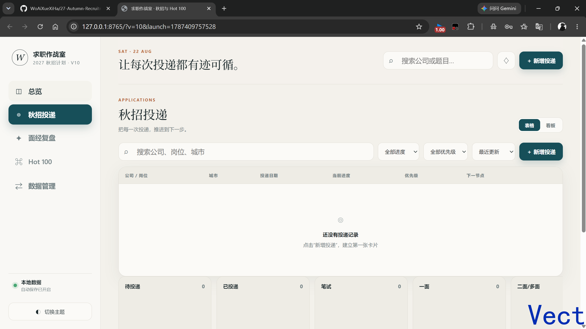
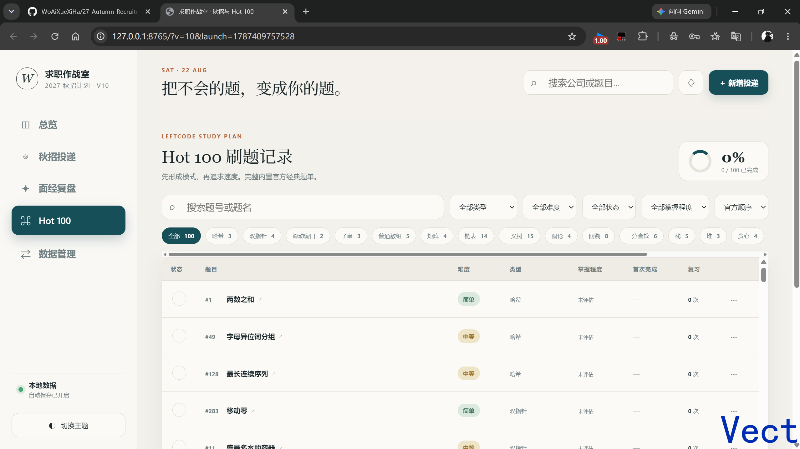
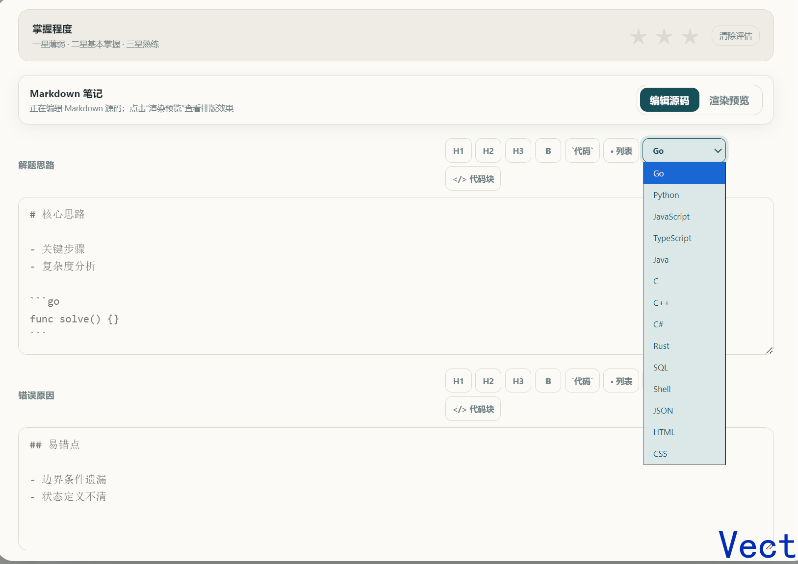
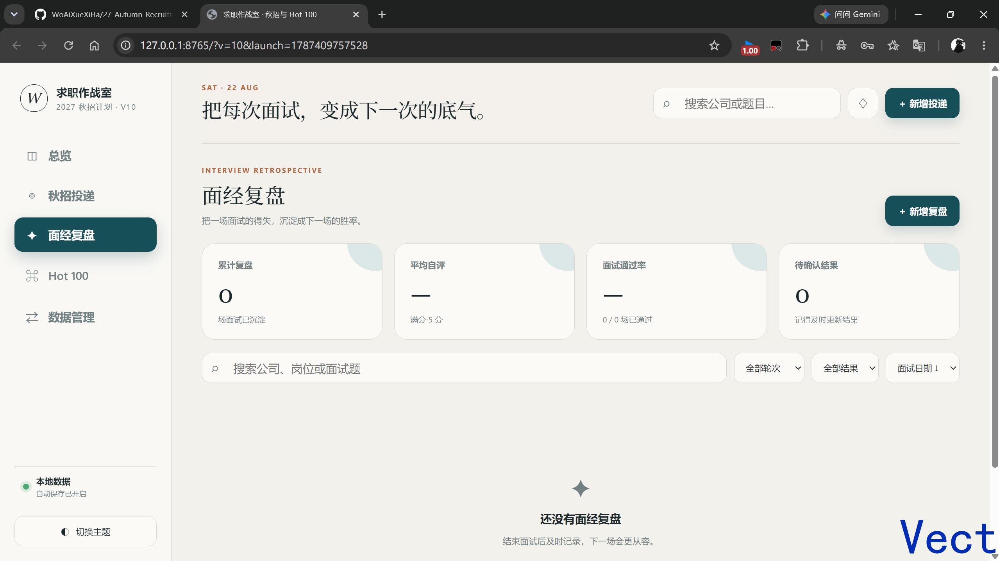
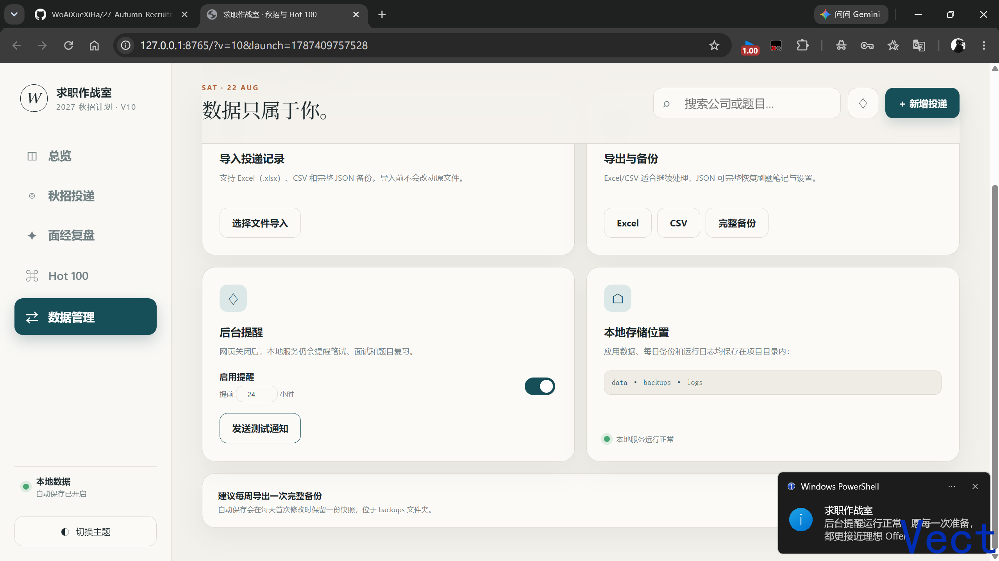

# 求职作战室



一个面向秋招、实习和校招准备的 Windows 本地看板，集中管理岗位投递、面经复盘与 LeetCode Hot 100 刷题记录。

项目使用 Python 标准库提供本地服务，不需要数据库、Node.js、云服务或第三方账号。所有个人数据只保存在项目目录中，网页关闭后仍可通过后台服务发送本地提醒。

> 当前版本：v10

作者：**Vect**

## 功能概览

### 秋招投递看板



- 记录公司、岗位、城市、投递渠道、投递日期、当前阶段和优先级。
- 可补充笔试时间、面试时间、薪资范围、岗位链接和备注。
- 支持搜索、状态筛选和排序。
- 首页展示累计投递、面试进度、Offer 数量、近期笔试/面试和投递转化。

### Hot 100 刷题记录



- 内置完整的 LeetCode Hot 100 题目及题号、难度、分类和题目链接。
- 每道题可记录完成状态、首次完成时间、解题思路、错误原因、复习次数和下次复习时间。
- 支持未评估、一星、二星、三星掌握程度。
- 支持按题名或题号搜索，并按类型、难度、状态和掌握程度筛选。
- 支持官方顺序、题号、难度和下次复习时间排序。
- 点击题名可直接打开对应的力扣中文站题目。

### Markdown 刷题笔记



“解题思路”和“错误原因”支持安全的轻量 Markdown：

| 功能 | 写法 |
| --- | --- |
| 一级标题 | `# 标题` |
| 二级标题 | `## 标题` |
| 三级标题 | `### 标题` |
| 加粗 | `**重点**` |
| 行内代码 | `` `nums[i]` `` |
| 无序列表 | `- 列表项` 或 `* 列表项` |
| 多语言代码块 | 三个反引号加语言名，例如 `python`、`javascript` |

编辑器工具栏可快捷插入上述格式。“编辑源码”用于修改原始 Markdown，“渲染预览”用于查看排版结果。有笔记的题目再次打开时默认显示预览。

代码块支持 Go、Python、JavaScript、TypeScript、Java、C、C++、C#、Rust、SQL、Shell、JSON、HTML/XML 和 CSS 离线高亮。工具栏可以先选择语言，再插入对应围栏；常用别名如 `js`、`ts`、`py`、`sh`、`cs` 也能识别。未识别语言仍会显示为安全的纯文本代码框。渲染器会先转义 HTML，不执行脚本、原始 HTML 或外部扩展语法。

示例：

````markdown
## 哈希表思路

- 遍历数组并检查 `target - nums[i]`
- 使用 **哈希表** 保存已经访问的元素

```go
func twoSum(nums []int, target int) []int {
    seen := map[int]int{}
    for i, value := range nums {
        if j, ok := seen[target-value]; ok {
            return []int{j, i}
        }
        seen[value] = i
    }
    return nil
}
```
````

### 面经复盘



- 可关联已有投递，也可单独创建。
- 记录公司、岗位、面试日期、轮次、形式、结果和自评分数。
- 分区整理面试问题、发挥较好的地方、暴露的问题和下一步行动。
- 支持搜索、结果筛选和时间排序。

### 本地提醒



- 覆盖笔试时间、面试时间和 Hot 100 下次复习时间。
- 默认提前 24 小时提醒，可设置为 1–168 小时。
- 网页关闭后，只要本地后台服务仍在运行，提醒就会继续工作。
- 同一时间节点只提醒一次；修改时间后会按照新时间重新计算。

### 数据管理


- 自动保存所有修改。
- 每天首次修改前在 `backups` 中保留一份数据快照。
- 导入 `.xlsx`、`.csv`、`.tsv` 和 `.json`。
- 导出 Excel、CSV 或包含全部记录与设置的 JSON 备份。
- 支持浅色、深色和跟随系统主题。

## 运行要求

- Windows 10 或 Windows 11。
- Python 3.10 或更高版本，安装时勾选将 Python 加入 PATH。
- 浏览器：Edge、Chrome、Firefox 等现代浏览器均可。

应用仅使用 Python 标准库，不需要执行 `pip install`。

## 快速开始

### 方式一：双击启动

1. 下载仓库并解压到一个长期保留的目录，路径中可以包含中文和空格。
2. 双击 `启动看板.cmd`。
3. 浏览器会打开 `http://127.0.0.1:8765/`。
4. 首次运行时会自动创建 `data/state.json`、`backups` 和 `logs`。

启动脚本会先平滑停止旧实例，再启动当前目录中的最新版，并为打开地址添加唯一参数，避免浏览器复用旧页面缓存。

### 方式二：命令行启动

```powershell
py -3 app.py --open
```

可选参数：

```text
--open          启动后打开浏览器
--stop          停止已经运行的本地服务
--no-reminder   启动服务但不运行后台提醒
```

## 启动与停止

| 文件 | 用途 |
| --- | --- |
| `启动看板.cmd` | 启动或刷新后台服务并打开看板 |
| `停止看板.cmd` | 完全停止后台服务和提醒 |
| `加入开机启动.cmd` | 在 Windows 启动文件夹中创建快捷方式 |
| `取消开机启动.cmd` | 移除开机启动快捷方式 |
| `start.cmd` / `stop.cmd` | 英文文件名的底层启动、停止脚本 |

浏览器标签页关闭并不等于停止服务。需要完全退出时，请双击 `停止看板.cmd`。

## 配置开机启动

1. 双击 `加入开机启动.cmd`，执行一次即可。
2. Windows 下次登录时会自动运行 `start.cmd`。
3. 如需取消，双击 `取消开机启动.cmd`。

移动或重命名项目目录后，请先取消开机启动，再重新加入，以更新快捷方式路径。

## 使用后台通知

1. 启动看板并进入“数据管理”。
2. 确认“启用提醒”已经打开。
3. 设置希望提前提醒的小时数。
4. 点击“发送测试通知”。

通知使用 Windows 托盘气泡，不需要安装额外模块或注册应用身份。若没有收到通知，请检查 Windows 的通知设置、勿扰模式，以及任务栏通知区域是否被系统策略禁用。测试按钮会根据通知脚本的真实退出结果显示成功或具体错误，不再无条件提示“已发送”。

## 数据保存位置

```text
data/state.json       当前的全部个人记录与设置
data/hot100.json      内置 Hot 100 基础题库
backups/              每日自动数据快照
logs/server.log       本地服务访问与错误日志
```

`state.json` 包含投递、面经、刷题笔记、复习状态、掌握程度、主题和提醒历史。它已经加入 `.gitignore`，不会在正常的 `git add .` 中被提交。

`hot100.json` 是应用自带的公共题库，应该保留在仓库中。

## 备份与恢复

### 完整备份

进入“数据管理”，点击“完整备份”，浏览器会下载一个 JSON 文件。它包含投递、面经、刷题进度、Markdown 笔记和设置，是推荐的迁移方式。

### 恢复完整备份

1. 进入“数据管理”。
2. 点击“选择文件导入”。
3. 选择此前导出的完整 JSON 文件。
4. 等待页面提示导入成功。

导入前建议再导出一次当前数据。Excel 和 CSV 主要用于投递记录，不包含完整刷题与面经信息。

## 导入投递记录

Excel、CSV 和 TSV 表头支持中文或英文常见写法。推荐字段如下：

```text
公司,岗位,城市,渠道,投递日期,状态,笔试时间,面试时间,优先级,薪资,链接,备注
```

至少填写公司或岗位。日期推荐使用 `YYYY-MM-DD`，日期时间推荐使用 `YYYY-MM-DDTHH:mm`。

## 项目结构

```text
求职作战室/
├─ app.py                 本地 HTTP 服务、数据读写、导入导出与提醒调度
├─ notify.ps1             Windows 系统通知脚本
├─ static/
│  ├─ index.html          页面结构
│  ├─ styles.css          界面样式与深色模式
│  └─ app.js              看板交互、筛选、Markdown 和自动保存
├─ data/
│  └─ hot100.json         内置 Hot 100 题库
├─ tests_smoke.py         非破坏性冒烟测试
├─ launch.ps1             刷新服务并打开已确认版本的页面
├─ start.cmd / stop.cmd   后台服务脚本
└─ 启动看板.cmd 等         面向 Windows 用户的快捷入口
```

## 本地开发

修改前端文件后不需要构建，刷新页面即可。若修改了 `app.py`，请重新运行启动脚本。

运行测试：

```powershell
py -3 tests_smoke.py
```

测试会临时写入投递、面经、Markdown 和掌握程度数据，结束时自动恢复原始 `state.json`。请确保本地服务已经启动。

默认地址和端口定义在 `app.py`：

```python
HOST = "127.0.0.1"
PORT = 8765
```

服务只监听本机回环地址，局域网和互联网中的其他设备无法直接访问。

## 隐私与安全

- 项目不需要登录，也不会主动上传数据。
- 岗位链接和力扣链接只有在用户点击时才会访问对应网站。
- Markdown 渲染前会转义 HTML，避免笔记注入脚本。
- 导入文件仅由本地 Python 服务解析。
- 发布代码前不要强制添加被 `.gitignore` 排除的 `state.json`、备份或日志。

可以在提交前执行：

```powershell
git status --short
git check-ignore data/state.json logs/server.log
```

## 常见问题

### 双击启动后页面看起来还是旧版本

检查左侧版本号，并确认地址包含 `?v=...&launch=...`。新版启动脚本会生成唯一地址；如果仍看到旧标签页，可以关闭旧标签页后重新双击启动。

### 端口 8765 被占用

先双击 `停止看板.cmd`，再重新启动。若其他程序占用了该端口，可修改 `app.py` 中的 `PORT`。

### 网页关闭后为什么仍有后台进程

这是为了继续自动保存和发送到期提醒。双击 `停止看板.cmd` 可完全退出。

### 为什么 GitHub 中没有 `state.json`

这是有意的隐私保护。首次运行会自动创建一个空白状态文件，个人记录不应进入公共仓库。

### 是否支持 macOS 或 Linux

核心 Python 服务和网页大部分可以运行，但当前启动脚本、开机启动与系统通知针对 Windows 编写。其他系统可使用 `python3 app.py --open` 启动，但需要自行适配通知方式。

## 参与贡献

欢迎提交 Issue 和 Pull Request。建议在提交前：

1. 确认没有提交个人投递、笔记、备份或日志。
2. 启动本地服务并运行 `py -3 tests_smoke.py`。
3. 对新增功能补充必要测试与 README 说明。
4. 保持离线优先，不引入不必要的联网依赖。

## 开源许可

本项目由 **Vect** 以 [MIT License](LICENSE) 开源。

任何人都可以免费使用、复制、修改、合并、发布、分发、再许可或销售本项目的软件副本，但必须在副本或重要衍生版本中保留原版权声明和 MIT 许可声明。本项目按“原样”提供，作者不对使用本项目产生的问题承担担保责任。

## 写在最后

祝大家都能拿到自己满意的 offer~

也欢迎各位朋友一起讨论交流~
